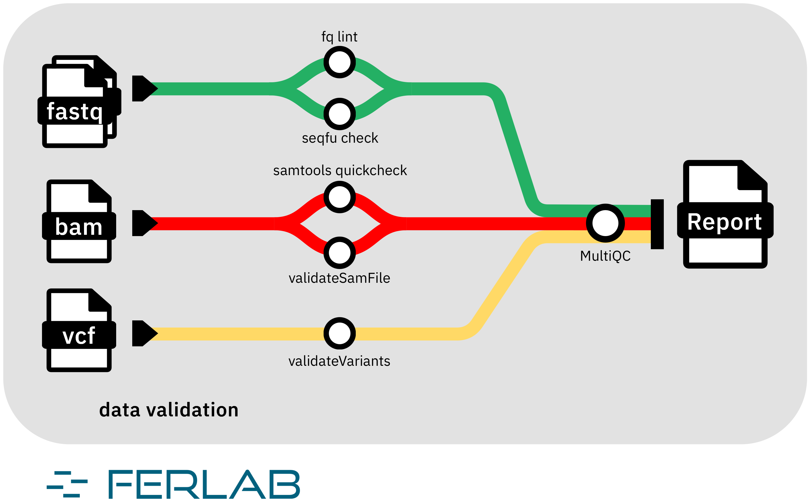

# Ferlab-Ste-Justine/seq-data-validation

[](https://www.nf-test.com)
[](https://www.nextflow.io/)
[](https://github.com/nf-core/tools/releases/tag/3.3.2)

## Introduction

**Ferlab-Ste-Justine/seq-data-validation** is a bioinformatics pipeline that validates the integrity and format of sequencing data files including FASTQ, BAM/CRAM, and VCF/GVCF files. It performs a series of checks to ensure that the files are not corrupted, conform to expected formats, and (optionally) contain valid variant information. The pipeline generates a comprehensive report summarizing the validation results for each file.

<!-- TODO nf-core:
   Complete this sentence with a 2-3 sentence summary of what types of data the pipeline ingests, a brief overview of the
   major pipeline sections and the types of output it produces. You're giving an overview to someone new
   to nf-core here, in 15-20 seconds. For an example, see https://github.com/nf-core/rnaseq/blob/master/README.md#introduction
-->

## Pipeline Summary

The pipeline consists of three streams to validate different types of sequencing data:

- **FASTQ** - Verify fastq integrity and matching pairs (if PE) with `fq lint` and `seqfu check`.
- **BAM/CRAM** - Validate file integrity, format, checks reference, validate index, and diagnose erros with `samtools quickcheck` and `picard validateSamFile`.
- **GVCF/VCF** - Validate integrity, format, and (optionally) variants with `gatk4 validateVariants`.

It accepts a mixed input of FASTQ, BAM/CRAM, and VCF/GVCF files and internally separates the files by data type, running the relevant stream.

At the end, it produces a report summarising the status (PASS/FAIL) of each submitted data file and index, visualized with MultiQC.



This schema was done using [draw.io](https://app.diagrams.net/) with the good pratices recommended by the nf-core community. See [nf-core Graphic Design](https://nf-co.re/docs/guidelines/graphic_design).

## Usage

> [!NOTE]
> If you are new to Nextflow and nf-core, please refer to [this page](https://nf-co.re/docs/usage/installation) on how to set-up Nextflow. Make sure to [test your setup](https://nf-co.re/docs/usage/introduction#how-to-run-a-pipeline) with `-profile test` before running the workflow on actual data.

First, prepare a samplesheet with your input data that looks as follows:

`samplesheet.csv`:

```csv
participant,sample,strategy,lane,fileType,file1,file2
P001,S001,WGS,L001,FASTQ,sample1_R1.fastq.gz,sample1_R2.fastq.gz
P001,S001,WGS,,BAM,sample1.bam,sample1.bam.bai
P001,S001,WGS,,GVCF,sample1.gvcf,sample1.gvcf.idx
```

Each row represents a data file or a pair of files (FASTQ pairs or data file and its index). The `fileType` column indicates the type of data (FASTQ, BAM, CRAM, VCF, GVCF). The `file1` and `file2` columns contain the paths to the data files. For single-end FASTQ files or data files without an index, leave the `file2` column empty.

Now, you can run the pipeline:

Locally using the test profile with Docker:

```bash
nextflow run . -profile test,docker --outdir <OUTDIR>
```

In a production environment with a specific configuration and parameters:

```bash
nextflow -c app.config run Ferlab-Ste-Justine/seq-data-validation \
    -r v1.0.0 \
    --input samplesheet.csv \
    --outdir <OUTDIR> \
    -params-file params.json
```

> [!WARNING]
> Please provide pipeline parameters via the CLI or Nextflow `-params-file` option. Custom config files including those provided by the `-c` Nextflow option can be used to provide any configuration _**except for parameters**_; see [docs](https://nf-co.re/docs/usage/getting_started/configuration#custom-configuration-files).

## Credits

Ferlab-Ste-Justine/seq-data-validation was originally written by Georgette Femerling, Samantha Yuen, Félix-Antoine Le Sieur, Lysiane Bouchard, David Morais.

We thank the Ferlab team and its partners for their support and collaboration in the development of this pipeline.

<!-- TODO nf-core: If applicable, make list of people who have also contributed -->

## Contributions and Support

If you would like to contribute to this pipeline, please see the [contributing guidelines](.github/CONTRIBUTING.md).

## Citations

<!-- TODO nf-core: Add citation for pipeline after first release. Uncomment lines below and update Zenodo doi and badge at the top of this file. -->
<!-- If you use Ferlab-Ste-Justine/seq-data-validation for your analysis, please cite it using the following doi: [10.5281/zenodo.XXXXXX](https://doi.org/10.5281/zenodo.XXXXXX) -->

An extensive list of references for the tools used by the pipeline can be found in the [`CITATIONS.md`](CITATIONS.md) file.

This pipeline uses code and infrastructure developed and maintained by the [nf-core](https://nf-co.re) community, reused here under the [MIT license](https://github.com/nf-core/tools/blob/main/LICENSE).

> **The nf-core framework for community-curated bioinformatics pipelines.**
>
> Philip Ewels, Alexander Peltzer, Sven Fillinger, Harshil Patel, Johannes Alneberg, Andreas Wilm, Maxime Ulysse Garcia, Paolo Di Tommaso & Sven Nahnsen.
>
> _Nat Biotechnol._ 2020 Feb 13. doi: [10.1038/s41587-020-0439-x](https://dx.doi.org/10.1038/s41587-020-0439-x).
